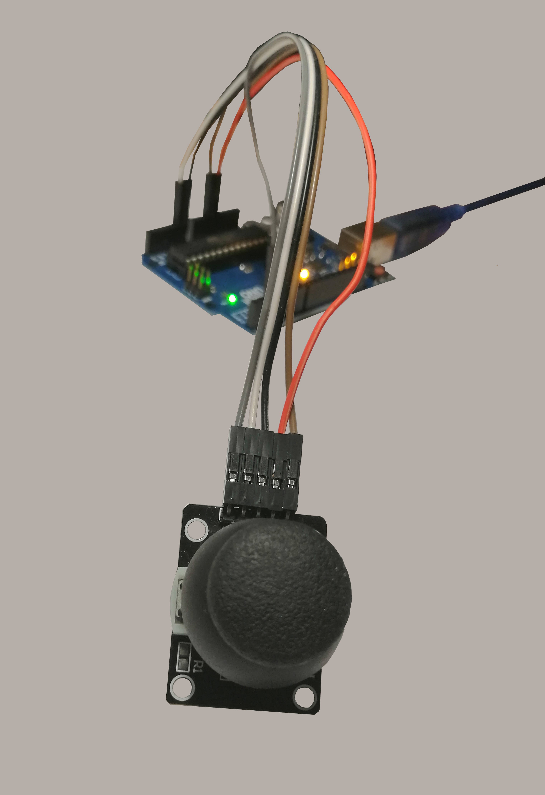

# FireflyGame

A simple game in Julia. The firefly can be controlled with a joystick that was part of an Arduino kit. The graphics were made with `GLMakie.jl`.

https://user-images.githubusercontent.com/60656686/211416075-77a4227c-44a9-4389-94ae-588d01c34a54.mp4

**Here is the used joystick:**

